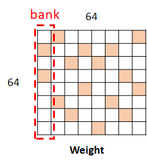

# Pruning Tools by Moffett AI
**This repo provides pruning tools for neural network pruning in pytorch and mxnet.**

### 1. Pruning from a dense model

In order to prune their neural networks, users only need to add a few lines of codes to setup the pruning configurations and initialize the pruning process. For example:

    # use a dictionary to setup pruning configuration
    prune_dict = {}
    for k, v in model.named_parameters():
        prune_dict[k] = 0.95

    # define the pruning specs
    prune = Prune(
        model = model,
        pretrain_step = 0, # this is set to 0 if pretrained model is loaded, otherwise this is the training steps for a dense model
        sparse_step = 20000,
        frequency = 100,
        prune_dict = prune_dict
        balance = 'fix')
        # balance = 'fix' for bank-balanced pruning
        # balance = 'none' for unstructured pruning

    # training loop
    for idx in range(epoch):
        # your training code here
        ......
        optimizer.step()
        # prune one step
        prune.prune()
        ......

    # check the sparsity of each layer during pruning
    layer_sparse_rate, total_sparse_rate = prune.sparsity()

### 2. Pruning for deployment on Moffett's Platform

To achieve acceleration proportional to the sparsity on Moffett's sparse acceleration engine, a "bank balanced sparsity" option is achieved by setting 'balance = fix' in the setup.

The concept of bank balanced sparsity is to prune the weight tensors in a way that every pre-defined bank has the same number of non-zero elements. The concept is shown as the figure below. Here we use a bank size of 64.

### This repo includes the following contents:

#### 1. pruning tools used in pytorch and mxnet：

    [x] pruning_tools/mxnet_pruning.so

    [x] pruning_tools/pytorch_pruning.so

Detailed documents for pruning optimizers:

[document for pytorch pruning tools](./docs/pytorch_parameters.md)

[document for mxnet pruning tools](./docs/mxnet_parameters.md)

#### 2. Examples of using pruning optimizers on mnist dataset:
    [x] example/mxnet_pruning_mnist.py
    [x] example/pytorch_pruning_mnist.py

---
### 3. An example of pruning results
Here is the pruning results for resnet50_v1b on imagenet dataset

|model|framework|training dataset|sparsity|top1|
|-|-|-|-|-|
|simple cnn|mxnet|mnist|0%|98.9%|
|simple cnn|mxnet|mnist|90.0%|98.8%|
|simple cnn|pytorch|mnist|0%|98.6%|
|simple cnn|pytorch|mnist|90.0%|98.9%|
